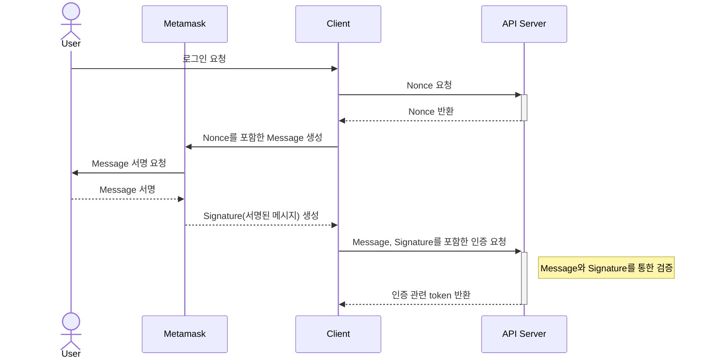

## Sample Components

boilerplate 내부의 component 및 page 등은 이해를 돕기 위한 코드입니다.

필요가 없거나 수정이 필요한 경우, 삭제 및 수정하셔도 무방합니다.

## Swagger Export Typescript

### `api-service.ts` 생성

로컬 서버를 띄운 후, 대상이 될 URL을 획득합니다\
(swaggerURL 경로에 -yaml 추가가 필요합니다)

`.env.***`에 swagger url 입력합니다

```
SWAGGER_URL=${swagger_url}
```

Swagger에 맞게 typescript를 export 합니다

```
pnpm run generate-api
```

`src/generated/api` 폴더 내부에 api 관련 로직이 포함된 `api-service.ts` 파일이 생성됩니다.

### `apiService.ts` 생성

위 과정 이후 `src/lib` 폴더 안에 아래의 코드를 포함한 `apiService.ts` 파일을 생성합니다.

```ts
import { Api } from '@/generated/api/api-service';

export const apiService = new Api({
  baseUrl: process.env.BASE_API_URL,
});
```

모든 api 호출 `apiService.ts` 를 import 한 후 사용하시면 되겠습니다.

## Keycloak 설정

Keycloak URL (dev: https://accounts.hqloud.blocksmith.xyz) 에서 렐름 생성<br />
boilerplate 용 렐름은 dev-keycloak-authentication <br />
환경변수 값 다음과 같이 세팅

```
KEYCLOAK_BASE_URL=https://accounts.hqloud.blocksmith.xyz/realms/{생성 렐름 이름}/protocol/openid-connect/token
KEYCLOAK_ISSUER=https://accounts.hqloud.blocksmith.xyz/realms/{생성 렐름 이름}
KEYCLOAK_CLIENT_ID=Keycloak 콘솔에서 Clients -> Settings -> ClientID
```

관련하여 자세한 샘플 코드는 `addon/keycloak` 을 참고바랍니다.

## react-i18n 설정

### 번역 파일 생성

언어별 번역 정보를 담은 json 파일 생성합니다. (파일명은 예시입니다.)

```
.
└── project/
    └── locales/
        ├── en/
        │   ├── common.json
        │   ├── landing.json
        │   └── ...
        └── ko/
            ├── common.json
            ├── landing.json
            └── ...
```

### config 설정

```js
// i18n.config.js
const i18nConfig = {
  locales: ['en', 'ko', ... ],
  defaultLocale: 'en',
};

module.exports = i18nConfig;
```

관련하여 자세한 샘플 코드는 `feature/react-i18n` 을 참고바랍니다.

## Dockerize

빌드

```
docker build .  -t next-docker
```

도커 실행

```
docker run -dp 3000:3000 next-docker
```

## SIWE (Sign-In with Ethereum)

[EIP-4361](https://eips.ethereum.org/EIPS/eip-4361)(SIWE)는 사용자 Wallet을 통해 `Nonce`를 포함한 정형화된 메시지에 서명하여 오프체인 서비스로 인증하는 방법입니다.

### 동작 원리



1. 유저가 로그인시 클라이언트는 서버로 서명할 메시지(`Nonce`)에 대한 요청을 보냅니다.
2. 클라이언트에서는 응답받은 `Nonce` 값을 가공하여 [정형화된 메시지](https://eips.ethereum.org/EIPS/eip-4361#message-format)를 생성합니다.
3. 유저는 Metamask 등의 wallet application을 통해 개인 키를 사용하여 `메시지`에 서명합니다.
4. 클라이언트는 `메시지`와 `서명된 메시지(Signature)`를 포함하여 서버로 `sign-in 요청`을 합니다.
5. 서버는 `메시지`와 `서명된 메시지(Signature)`를 통해 서명의 유효성을 검증합니다.
6. 확인이 성공하면 서버는 token을 부여합니다

### Dependencies

- Server

  이 작업물의 API는 [wallet login을 위한 boilerplate server](https://gitlab.com/memecore1/boilerplate/nestjs-boilerplate/-/tree/common_wallet-dooyong?ref_type=heads)를 기반으로 하고 있습니다.

- Wallet Application - MetaMask

- Thirdpary libraries (Front)

  - Verification - [SIWE](https://docs.login.xyz/general-information/siwe-overview)

    SIWE 메시지 생성

    ```
    pnpm add siwe
    ```

  - Wallet Connect - [Rainbowkit](https://www.rainbowkit.com/docs/introduction)

    지갑 연결 및 관리

    ```
    pnpm add @rainbow-me/rainbowkit wagmi viem@2.x @tanstack/react-query
    ```

  - Global state - [Zustand](https://github.com/pmndrs/zustand)

    유저 authentication에 대한 상태를 관리

    ```
    pnpm add zustand
    ```

### 세부 사항

- Web3 configuration

  `WagmiProvider`의 config 속성을 통해 사용할 네트워크, rpc endpoint 등의 configuration 값을 주입합니다.

  ```ts
  'use client';

  import { FC, PropsWithChildren } from 'react';
  import { WagmiProvider } from 'wagmi';

  import { config } from '@/config';

  const Web3Provider: FC<PropsWithChildren> = ({ children }) => {
    return <WagmiProvider config={config}>{children}</WagmiProvider>;
  };

  export default Web3Provider;
  ```

  $\small{\color{#656565}src/providers/wagmiProvider.tsx}$

  ref : https://wagmi.sh/react/api/createConfig

- 지갑 연결 및 인증

  `@rainbow-me/rainbowkit`을 통해 authentication 관련된 로직을 사용하기 위해 `RainbowKitAuthenticationProvider`가 필요합니다.

  `adapter` 속성을 통해 SIWE 로직을, `status`를 통해 유저 authentication 상태를 주입합니다.

  ```ts
  const WalletProvider: FC<PropsWithChildren> = ({ children }) => {
    const { loginStatus } = useLoginStatus();
    const { authAdapter } = useSiweAdapter();

    return (
      <Web3Provider>
        <ReactQueryProvider>
          <RainbowKitAuthenticationProvider
            adapter={authAdapter}
            status={loginStatus}
          >
            <RainbowKitProvider>{children}</RainbowKitProvider>
          </RainbowKitAuthenticationProvider>
        </ReactQueryProvider>
      </Web3Provider>
    );
  };
  ```

  $\small{\color{#656565}src/providers/walletProvider.tsx}$

  `adapter`는 `createAuthenticationAdapter`를 통해 생성합니다.
  `createAuthenticationAdapter`에는 다섯 가지 함수가 정의되야 합니다.

  - `getNonce` - 서명할 메시지에 포함될 `Nonce`를 생성합니다. 해당 작업물에서는 서버에 해당 값을 요청합니다.
  - `createMessage` - 정형화된 메시지를 생성합니다.
  - `getMessageBody` - 정형화된 메시지를 서명할 수 있는 형식으로 parsing 합니다.
  - `verify` - message와 signature를 통해 유저를 검증합니다. 해당 작업물에서는 서버에 message와 signature를 전달 후 서버에서 검증 과정이 진행됩니다.
  - `signOut` - sign out과 관련된 로직입니다.

  ```ts
  const authAdapter = createAuthenticationAdapter({
    getNonce: async () => {
      const resp = await fetch('/api/siwe/message', {
        method: 'GET',
      });
      const { nonce } = await resp.json();

      return nonce;
    },
    createMessage: ({ nonce, address, chainId }) => {
      return new SiweMessage({
        domain: window.location.host,
        address,
        statement: 'Welcome to ANT Service!',
        uri: window.location.origin,
        version: '1',
        chainId,
        nonce,
      });
    },
    getMessageBody: ({ message }) => message.prepareMessage(),
    verify: async ({ message, signature }) => {
      setLoginStatus('loading');
      try {
        await fetch('/api/siwe/sign-in', {
          method: 'POST',
          body: JSON.stringify({ message, signature }),
        });

        setLoginStatus('authenticated');
        return true;
      } catch (error) {
        setLoginStatus('unauthenticated');
        console.error(error);
        return false;
      }
    },
    signOut: async () => {
      setLoginStatus('unauthenticated');
      await apiService.wallet.walletControllerSignout();
    },
  });
  ```

  $\small{\color{#656565}src/hooks/useSiweAdapter.ts}$
