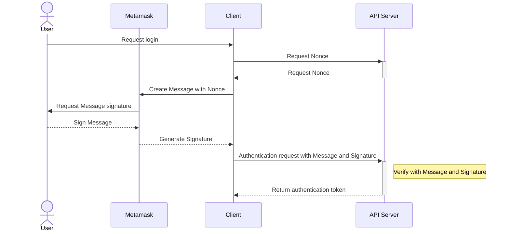

\*\*## Sample Components

The components and pages within the boilerplate are provided for understanding purposes.

You are free to delete or modify them if they are unnecessary or require changes.

## Environment Variables and Config Guidelines

### Public Environment Variables and Config

Values that do not impact security are managed by `.env.***` files.

- Local : `.env.local`
- Development : `.env.development`
- Production : `.env.production`

Files other than `.env.local` are not added to `.gitignore` and are included in the repository.

### Secret Environment Variables and Config

- Local

  Depending on your preference, inject environment variables (`.env.local`, `export`, `direnv`).

- Development and Production

  1. Request the DevOps team to create environment variables in AWS Secrets Manager.
  2. Wait for the MR for IRSA and other settings from the DevOps team.
  3. After the MR is completed, confirm deployment.

## Swagger Export Typescript

### Creating `api-service.ts`

Start the local server and obtain the target URL\
(It is necessary to add -yaml to the swaggerURL path).

Enter the swagger URL in the `.env.***` file.

```
SWAGGER_URL=${swagger_url}
```

Export typescript file according to Swagger.

```
pnpm run generate-api
```

The `api-service.ts` file containing the API logic will be created inside the `src/generated/api` folder.

### Creating `apiService.ts`

After the above process, create the `apiService.ts` file with the following code inside the `src/lib` folder.

```ts
import { Api } from '@/generated/api/api-service';

export const apiService = new Api({
  baseUrl: process.env.BASE_API_URL,
});
```

You can use `apiService.ts` for all API calls by importing it.

## Keycloak Configuration

Create a realm on the Keycloak URL (dev: https://accounts.hqloud.blocksmith.xyz)<br />
The realm for the boilerplate is dev-keycloak-authentication <br />
Set environment variable values as follows:

```
KEYCLOAK_BASE_URL=https://accounts.hqloud.blocksmith.xyz/realms/{생성 렐름 이름}/protocol/openid-connect/token
KEYCLOAK_ISSUER=https://accounts.hqloud.blocksmith.xyz/realms/{생성 렐름 이름}
KEYCLOAK_CLIENT_ID=Keycloak 콘솔에서 Clients -> Settings -> ClientID
```

For detailed sample code, refer to `addon/keycloak`.

## react-i18n Configuration

### Creating Translation Files

Create JSON files containing translation information for each language (the filenames are examples).

```
.
└── project/
    └── locales/
        ├── en/
        │   ├── common.json
        │   ├── landing.json
        │   └── ...
        └── jp/
            ├── common.json
            ├── landing.json
            └── ...
```

### Config Settings

```js
// i18n.config.js
const i18nConfig = {
  locales: ['en', 'jp', ... ],
  defaultLocale: 'en',
};

module.exports = i18nConfig;
```

For detailed sample code, refer to `addon/react-i18n`.

## Dockerize

Build

```
docker build .  -t next-docker
```

Run Docker

```
docker run -dp 3000:3000 next-docker
```

## SIWE (Sign-In with Ethereum)

[EIP-4361](https://eips.ethereum.org/EIPS/eip-4361)(SIWE)s a method of authentication to an off-chain service by signing a standardized message containing a `Nonce` with the user's Wallet.

### How It Works



1. When a user logs in, the client sends a request to the server for the message (`Nonce`) to be signed.
2. The client processes the received `Nonce` to create a [standardized message](https://eips.ethereum.org/EIPS/eip-4361#message-format).
3. The user signs the `message` with their private key through a wallet application like Metamask.
4. The client sends the `message` and the `signed message (Signature)` to the server as a sign-in request.
5. The server verifies the validity of the signature with the `message` and the `signed message (Signature)`.
6. Upon successful verification, the server issues a token

### Dependencies

- Server

  The API for this work is based on the [boilerplate server for wallet login](https://gitlab.com/memecore1/boilerplate/nestjs-boilerplate/-/tree/common_wallet-dooyong?ref_type=heads).

- Wallet Application - MetaMask

- Thirdpary libraries (Front)

  - Verification - [SIWE](https://docs.login.xyz/general-information/siwe-overview)

    Generate SIWE message

    ```
    pnpm add siwe
    ```

  - Wallet Connect - [Rainbowkit](https://www.rainbowkit.com/docs/introduction)

    Connect and manage wallet

    ```
    pnpm add @rainbow-me/rainbowkit wagmi viem@2.x @tanstack/react-query
    ```

  - Global state - [Zustand](https://github.com/pmndrs/zustand)

    Manage user authentication state globally.

    ```
    pnpm add zustand
    ```

### Details

- Web3 configuration

  Inject configuration values such as networks and rpc endpoints through the config property of `WagmiProvider`.

  ```ts
  'use client';

  import { FC, PropsWithChildren } from 'react';
  import { WagmiProvider } from 'wagmi';

  import { config } from '@/config';

  const Web3Provider: FC<PropsWithChildren> = ({ children }) => {
    return <WagmiProvider config={config}>{children}</WagmiProvider>;
  };

  export default Web3Provider;
  ```

  $\small{\color{#656565}src/providers/wagmiProvider.tsx}$

  ref : https://wagmi.sh/react/api/createConfig

- Wallet Connection and Authentication

  To use authentication-related logic through `@rainbow-me/rainbowkit`, you need the `RainbowKitAuthenticationProvider`.

  Inject SIWE logic through the `adapter` property and user authentication status through `status`.

  ```ts
  const WalletProvider: FC<PropsWithChildren> = ({ children }) => {
    const { loginStatus } = useLoginStatus();
    const { authAdapter } = useSiweAdapter();

    return (
      <Web3Provider>
        <ReactQueryProvider>
          <RainbowKitAuthenticationProvider
            adapter={authAdapter}
            status={loginStatus}
          >
            <RainbowKitProvider>{children}</RainbowKitProvider>
          </RainbowKitAuthenticationProvider>
        </ReactQueryProvider>
      </Web3Provider>
    );
  };
  ```

  $\small{\color{#656565}src/providers/walletProvider.tsx}$

  Create the `adapter` through `createAuthenticationAdapter`.
  `createAuthenticationAdapter` should define following five functions.

  - `getNonce` - Generates the `Nonce` to be included in the message. In this boilerplate, the server is requested for this value.
  - `createMessage` - Creates a standardized message.
  - `getMessageBody` - Parses the standardized message into a format that can be signed.
  - `verify` - Verifies the user with the message and signature. In this boilerplate, the server handles the verification process by the message and signature from the client.
  - `signOut` - Logic related to sign-out.

  ```ts
  const authAdapter = createAuthenticationAdapter({
    getNonce: async () => {
      const resp = await fetch('/api/siwe/message', {
        method: 'GET',
      });
      const { nonce } = await resp.json();

      return nonce;
    },
    createMessage: ({ nonce, address, chainId }) => {
      return new SiweMessage({
        domain: window.location.host,
        address,
        statement: 'Welcome to ANT Service!',
        uri: window.location.origin,
        version: '1',
        chainId,
        nonce,
      });
    },
    getMessageBody: ({ message }) => message.prepareMessage(),
    verify: async ({ message, signature }) => {
      setLoginStatus('loading');
      try {
        await fetch('/api/siwe/sign-in', {
          method: 'POST',
          body: JSON.stringify({ message, signature }),
        });

        setLoginStatus('authenticated');
        return true;
      } catch (error) {
        setLoginStatus('unauthenticated');
        console.error(error);
        return false;
      }
    },
    signOut: async () => {
      setLoginStatus('unauthenticated');
      await apiService.user.walletControllerSignout();
    },
  });
  ```

  $\small{\color{#656565}src/hooks/useSiweAdapter.ts}$
  \*\*
